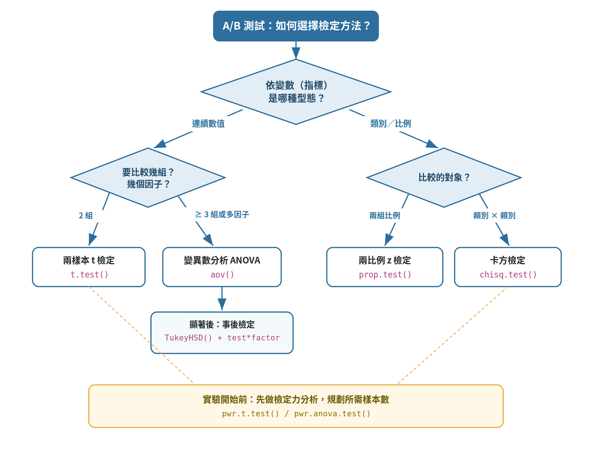

# A/B 測試 {#abtest}

```{r ch14-setup, include=FALSE}
knitr::opts_chunk$set(echo = TRUE, comment = "##", collapse = TRUE, message = FALSE, warning = FALSE, eval = FALSE)
```

**A/B 測試（A/B testing）**是網路產品與商業決策中最常用的因果推論方法：把使用者隨機分成兩組——**對照組（control, A）**維持現狀、**實驗組（treatment, B）**接受新設計，再比較某個指標（購買金額、轉換率）是否有顯著差異。因為分組是**隨機**的，兩組除了「處理」以外其他條件在統計上相同，因此差異可歸因於處理本身。本章用兩份資料，分別示範**比較平均數**與**比較比例**兩種情境，並涵蓋變異數分析、事後檢定與檢定力分析。

> 本章需要 `abtest.RData`（內含 `data1`、`data2` 兩個物件）。`.Rmd` 相關 chunk 預設 `eval = FALSE`，請把資料檔放進專案資料夾後再編譯。

```{r ab-load}
library(tidyverse)
load("abtest.RData")   # 載入後會有 data1（購買金額）與 data2（網站轉換）
str(data1)
summary(data1)
```

## 選擇檢定方法的決策流程 {#ab-decision}

A/B 測試最常讓人卡住的一步，是「這個情境到底該用哪一種檢定？」。判斷的關鍵，是先看**依變數（你要比較的指標）是什麼型態**，再看**要比較幾組**。下圖把本章會用到的檢定整理成一張決策流程圖：



若把上圖化為文字對照表：

| 依變數型態 | 比較情境 | 適用檢定 | R 函數 |
|------------|----------|----------|--------|
| 連續數值（如購買金額） | 兩組（實驗 vs 對照） | 兩樣本 t 檢定 | `t.test()` |
| 連續數值 | 三組以上或多個因子 | 變異數分析 ANOVA | `aov()` |
| 連續數值 | ANOVA 顯著後的兩兩比較 | Tukey HSD 事後檢定 | `TukeyHSD()` |
| 類別／比例（如是否購買） | 兩組比例（轉換率） | 兩比例 z 檢定 | `prop.test()` |
| 類別／比例 | 類別 × 類別 列聯表 | 卡方獨立性檢定 | `chisq.test()` |

無論選哪一種，**實驗開始前**都應先做**檢定力分析**（`pwr.t.test()`／`pwr.anova.test()`）規劃樣本數。以下依「比較平均數」與「比較比例」兩大情境逐一示範。

## 情境一：比較平均數 {#ab-means}

`data1` 記錄每位使用者的購買金額 `purchase`，以及分組 `test`（1 = 實驗組、0 = 對照組）與若干背景變數（`sex`、`device`、`service`、`country`、`date`）。

### 先做描述性比較

```{r ab-describe}
data1 %>%
  group_by(test) %>%
  summarise(mean_purchase = mean(purchase))   # 兩組的平均購買金額

data1 %>%
  group_by(country) %>%
  summarise(mean_purchase = mean(purchase))   # 也看看各國差異
```

* 先用 `group_by() %>% summarise()` 算各組平均，形成初步印象。但**平均有差不代表統計上顯著**——樣本本來就有隨機波動，需要正式的假設檢定。

### 兩樣本 t 檢定

檢定「實驗組平均是否高於對照組」，屬**單尾**檢定（$H_a:\mu_1-\mu_0>0$）：

```{r ab-ttest}
t.test(data1[data1$test == 1, ]$purchase,   # 實驗組的購買金額
       data1[data1$test == 0, ]$purchase,   # 對照組的購買金額
       alternative = "greater")             # 對立假設：實驗組較高
```

**逐行說明：**

* `data1[data1$test == 1, ]$purchase`：用邏輯索引取出實驗組的購買金額向量；對照組同理。
* `alternative = "greater"`：指定單尾檢定，只關心「實驗組是否**更高**」。
* 判讀：若 **p 值 < 0.05**（顯著水準），則拒絕 $H_0$，認為實驗組確實顯著較高。

### 變異數分析 ANOVA：多因子一起看

當想同時檢視多個因子（不只兩組）對購買金額的影響，用 **ANOVA**：

```{r ab-anova}
aov.model <- aov(purchase ~ test + country + device + sex + service, data1)
summary(aov.model)
```

* `aov(purchase ~ test + country + ...)`：以購買金額為反應變數，同時放入多個類別因子。`summary()` 給出每個因子的 F 值與 p 值，判斷各因子是否顯著影響購買金額。

### 交互作用

有時「處理的效果會因族群而異」——例如新設計對某國家特別有效。這用**交互作用項**檢查：

```{r ab-interaction}
interaction.model <- aov(purchase ~ test * sex + test * country, data1)
summary(interaction.model)

# 保留顯著的交互作用，得到最終模型
aov.model <- aov(purchase ~ test * sex + test * country, data1)
summary(aov.model)
```

* `test * sex` 展開為 `test + sex + test:sex`。若 `test:country` 顯著，代表「新設計的效果在不同國家不一樣」，這是行銷上非常有價值的洞察（可對特定國家加強推廣）。

### 事後檢定 Tukey HSD

ANOVA 只告訴我們「至少有一組不同」，但沒說是哪幾組。**Tukey HSD 事後檢定**做兩兩比較，並校正多重比較的誤差：

```{r ab-tukey}
TukeyHSD(aov.model, "test")
TukeyHSD(aov.model, "country")
plot(TukeyHSD(aov.model, "country"))   # 視覺化：信賴區間不含 0 者為顯著
```

* `TukeyHSD()` 對指定因子做所有兩兩比較，回傳差異估計與校正後信賴區間。圖上若某對比較的信賴區間**不跨過 0**，代表這兩組有顯著差異。

### 用視覺化輔助判讀

```{r ab-viz}
# 每日購買金額的時間走勢：實驗組 vs 對照組
daily.purchase <- data1 %>%
  group_by(date, test) %>%
  summarise(purchase_amount = mean(purchase))

ggplot(daily.purchase, aes(x = date, y = purchase_amount, colour = as.factor(test))) +
  geom_point() + geom_line() +
  labs(x = "Date", y = "Purchase Amount",
       title = "Purchase Amount: Test versus Control") +
  theme_bw()
```

* 把每日平均畫成時間走勢，可檢查兩組差異是否**穩定持續**（而非某天的偶發現象），這對判斷實驗結果的可信度很重要。

## 情境二：比較比例（轉換率） {#ab-proportion}

`data2` 記錄兩個網站版本 `website`（A/B）的訪客是否購買 `purchased`（TRUE/FALSE）。這裡關心的指標是**轉換率（conversion rate）**，屬於「比例」的比較。

### 手動計算轉換率與提升幅度

```{r ab-uplift}
# 各網站的購買人數與訪客數
purchased_A <- nrow(data2 %>% filter(website == "A" & purchased == "TRUE"))
visitors_A  <- nrow(data2 %>% filter(website == "A"))
phat_A <- purchased_A / visitors_A                 # A 的轉換率

purchased_B <- nrow(data2 %>% filter(website == "B" & purchased == "TRUE"))
visitors_B  <- nrow(data2 %>% filter(website == "B"))
phat_B <- purchased_B / visitors_B                 # B 的轉換率

uplift <- (phat_B - phat_A) / phat_A * 100         # B 相對 A 的提升百分比
uplift
```

* `phat_A`、`phat_B` 是兩版本的樣本轉換率；`uplift` 是 B 相對 A 的相對提升（例如 82.7% 表示 B 的轉換率比 A 高約 83%）。但同樣地，還需檢定這個差異是否顯著。

### 兩比例的 z 檢定（手動）

```{r ab-ztest}
p_pool  <- (purchased_A + purchased_B) / (visitors_A + visitors_B)          # 合併比例
SE_pool <- sqrt(p_pool * (1 - p_pool) * (1/visitors_A + 1/visitors_B))       # 合併標準誤
d_hat   <- phat_B - phat_A                                                    # 比例差
z_score <- d_hat / SE_pool                                                    # z 統計量
p_value <- pnorm(-z_score) * 2                                                # 雙尾 p 值

ci <- c(d_hat - qnorm(0.975) * SE_pool,
        d_hat + qnorm(0.975) * SE_pool)                                       # 95% 信賴區間
```

**逐行說明：**

* **合併比例（pooled proportion）**：在 $H_0$（兩版本轉換率相同）下，用兩組合起來估計共同的比例。
* `SE_pool`：在此假設下比例差的標準誤。
* `z_score = d_hat / SE_pool`：標準化的比例差；`pnorm(-z_score) * 2` 得雙尾 p 值。
* `ci`：比例差的 95% 信賴區間，若**不含 0** 則兩版本有顯著差異。

### 用內建函數驗證

手算之後，一定要用內建函數對照：

```{r ab-proptest}
prop.test(c(purchased_A, purchased_B), c(visitors_A, visitors_B))   # 兩比例檢定
chisq.test(data2$purchased, data2$website)                          # 卡方獨立性檢定
```

* `prop.test(成功數向量, 總數向量)`：直接做兩比例檢定，回傳的 p 值與信賴區間應與手算一致。
* `chisq.test()`：卡方檢定「購買與否」和「網站版本」是否獨立——對 2×2 表，結論與兩比例 z 檢定等價。

## 檢定力與樣本數 {#ab-power}

實驗**開始前**就該規劃「需要多少樣本，才能以足夠的把握偵測到有意義的差異」，這就是**檢定力分析（power analysis）**。四個量——效果量（effect size）、樣本數、顯著水準 $\alpha$、檢定力（power，通常 0.8）——知道其三可求第四：

```{r ab-power}
library(pwr)

# 兩組平均比較所需樣本數（效果量 d = 0.3）
pwr.t.test(d = 0.3, sig.level = 0.05, power = 0.8,
           type = "two.sample", alternative = "greater")

# ANOVA（k = 2 組，效果量 f = 0.2）
pwr.anova.test(k = 2, f = 0.2, sig.level = 0.05, power = 0.8)
```

* 把 `n` 留白（`NULL`）、其餘填入，函數就回推所需樣本數。**效果量越小、要求的檢定力越高，需要的樣本就越多**。事先做這一步，能避免「樣本太少而測不出差異」或「浪費資源蒐集過多資料」。

## 小結 {#ch14-summary}

A/B 測試靠**隨機分組**把相關性提升為因果推論。比較**平均數**時：兩組用 t 檢定，多因子用 ANOVA，並以交互作用檢查效果是否因族群而異，用 Tukey HSD 做校正後的兩兩比較。比較**比例（轉換率）**時：用兩比例 z 檢定或 `prop.test`，2×2 情形等價於卡方檢定，並可用 uplift 描述相對提升。無論哪種，都應在**實驗前用檢定力分析規劃樣本數**，並用視覺化檢查差異是否穩定持續。切記：平均或比例有差 ≠ 統計顯著，務必回到假設檢定下結論。

## 課後練習 {#ch14-exercises}

1. 用 `data1` 對「device（裝置）」做單因子 ANOVA，若顯著再用 Tukey HSD 找出哪些裝置間有差異。
2. 對 `data1` 建立含 `test:service` 交互作用的模型，解釋交互作用項是否顯著及其商業意涵。
3. 用 `data2` 分別計算 A、B 兩版本轉換率各自的 95% 信賴區間，並判斷是否重疊。
4. 若預期效果量 d = 0.2、要求 power = 0.9、$\alpha$ = 0.05，用 `pwr.t.test` 求每組所需樣本數，並與 d = 0.3 的情形比較。
